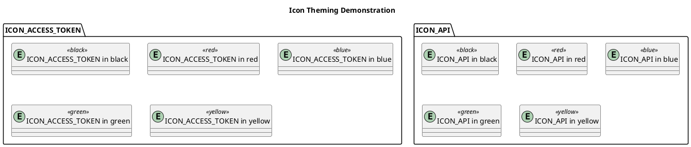

# PlantUML Identity Icon Sprites

>Note: This repo is a fork of https://github.com/UberEther/plantuml-identity-sprites


## Getting Started

This work was started with examples from the great script by Anthony in the PlantUML repo at [https://github.com/plantuml/plantuml/blob/master/tools/create_sprites.sh](https://github.com/plantuml/plantuml/blob/master/tools/create_sprites.sh)

```text
!define ICONURL https://raw.githubusercontent.com/uberether/plantuml-identity-sprites/main
```

Import the sprites that you want

```text
!include identicons-set-v1/icon_api.puml
!include identicons-set-v2/icon_browser.puml
!include identicons-set-v2/icon_webauthn.puml
```

or via url

```text
!includeurl ICONURL/common.puml
!includeurl ICONURL/identicons-set-v1/icon_api.puml
!includeurl ICONURL/identicons-set-v2/icon_browser.puml
!includeurl ICONURL/identicons-set-v2/icon_webauthn.puml
```

To use the sprites add one of the macros

```text
ID1_ICON_API(api)
```

The macros are prefixed with the set and the name of the icon

```text
<prefix>_<name>(alias)
<prefix>_<name>(alias,label)
<prefix>_<name>(alias,label,shape)
<prefix>_<name>(alias,label,shape,color)
```
## Icon Sets

The following icon sets are included:

| Name                                                                        | Index                                     |
| --------------------------------------------------------------------------- | ----------------------------------------- |
| [Identicons v1](identicons-set-v1/index.md)  | [List of macros](identicons-set-v1/index.md)   |
| [Identicons v2](identicons-set-v1/index.md)                        | [List of macros](identicons-set-v2/index.md) |


## Build

### Mac OSX

```sh
./create_sprites.sh -p identicons-set-v2 ID2
```

## Note

- All brand icons are trademarks of their respective owners.
- Thanks to tupadr3 for [plantuml-icon-font-sprites](https://github.com/tupadr3/plantuml-icon-font-sprites)
- Thanks to milo-minderbinder for [AWS-PlantUML](https://github.com/milo-minderbinder/AWS-PlantUML)
- Thanks to [yuri-becker](https://github.com/yuri-becker) for the integration of [Devicon 2](https://konpa.github.io/devicon/)

## Contributing

Contributions are welcome. In order to update an existing set of icons or to add a new icon set please fork the repository and use a feature branch.

## Changelog

### v1.0.0

- Initial release

Enjoy!


## Example


